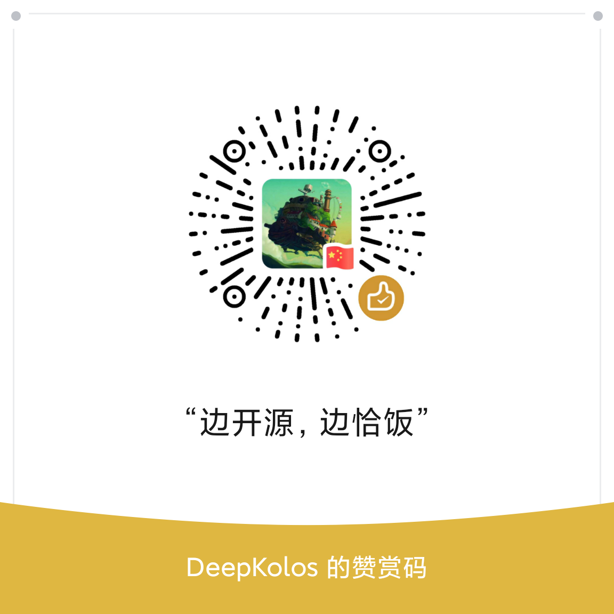

# three-platformzie-plugin-wechat

[three-platformzie](https://github.com/deepkolos/three-platformize) 的微信小程序插件，方便跨组件，跨小程序，跨插件使用
比如 3D 插件使用了此插件, AR 插件也使用了此插件, three 的代码就可以复用了

## 使用

`app.json`

```json
{
  "plugins": {
    "three-platformize": {
      "version": "1.0.0", // 由于个人号无法发布插件，可自行clone本仓库，发布使用
      "provider": "wxc28f248739f71667"
    }
  }
}
```

详细可参 `miniprogram\pages\index\index.js`

```js
const { THREE, WechatPlatform, GLTFLoader, OrbitControls } =
  requirePlugin('three-platformize');

// 正常three-platformzie的使用方式即可
```

目前仅仅集成了常用的`GLTFLoader`和`OrbitControls`，如果有其他 Loader 需求则需要手动注册到所导出的`THREE`里，可使用自行编写rollup plugin实现

# 赞助

如果项目对您有帮助或者有适配需求，欢迎打赏


